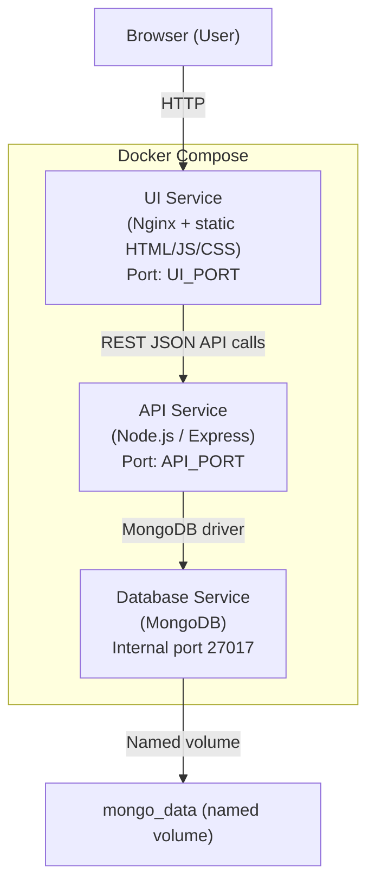

# Design Document

## Overview

The Job Application Tracker is a three-tier web application that lets users record, monitor, and manage job applications throughout the hiring process. The system comprises:

- **UI** – A browser-based frontend served as static assets (HTML/CSS/JS) from an Nginx container. It presents three views: an applications list, a status/progress view grouped by status, and a notes view.
- **API** – A Node.js/Express REST backend that exposes CRUD endpoints for application records, validates inputs, and reads/writes to MongoDB.
- **Database** – A MongoDB instance that persists application documents in a collection named `applications`.

All three components run as Docker containers coordinated by a `docker-compose.yml` file. Configuration is injected via environment variables (`.env` file or host environment), with environment variables taking precedence over any config file values.

### Key Design Decisions

- **Separation of concerns**: Each tier (UI, API, DB) lives in its own container with its own Dockerfile. The UI has no direct database access; all data flows through the API.
- **MongoDB as document store**: Job applications are naturally document-shaped (variable optional fields, free-text notes), making MongoDB a good fit without requiring schema migrations.
- **Config-driven, twelve-factor style**: No credentials or ports are hardcoded. A `.env.example` documents every key.
- **Single-page-style navigation without a framework**: The UI uses plain HTML/CSS/JS with fetch() calls to avoid heavy build tooling while still supporting multi-view navigation.

---

## Architecture



### Container Responsibilities

| Service | Image base | Exposed port | Key config |
|---------|-----------|-------------|------------|
| `ui` | `nginx:alpine` | `UI_PORT` (default `3000`) | Reverse-proxy `/api` to API service |
| `api` | `node:lts-alpine` | `API_PORT` (default `4000`) | `MONGODB_URI`, `DB_NAME`, `API_PORT` |
| `db` | `mongo:7` | internal only | Named volume `mongo_data` |

The UI Nginx config proxies `/api/…` requests to the API service, so the browser only ever talks to one origin (the UI port). This avoids CORS configuration.

### Startup Sequence

1. `db` service starts; MongoDB health check passes when `mongosh --eval "db.runCommand({ping:1})"` exits 0.
2. `api` service starts only after `db` is healthy (Docker Compose `depends_on: condition: service_healthy`). On startup the API validates config, connects to MongoDB, and begins listening.
3. `ui` service starts and serves static assets. It has no hard dependency on the API being ready because all API calls are initiated by the browser at runtime.

---

## Components and Interfaces

### UI Components

The UI is composed of three views navigated via a top navigation bar. Each view is rendered by vanilla JavaScript manipulating the DOM; no full page reload occurs for in-page interactions (status update, notes save).

#### View 1 – Applications List (`/` or `index.html`)

- Fetches `GET /api/applications` on load.
- Displays a table/card list sorted by timestamp descending (formatted `YYYY-MM-DD HH:MM`).
- Shows: company name, job title, job location, work arrangement, status badge, timestamp.
- Empty state: "No applications recorded yet."
- Error state: "Failed to load applications. Please try again." — no partial list rendered.
- "Add Application" button opens a form (inline or modal) that `POST`s to `/api/applications`.
- Each row has Edit and Delete action buttons.

#### View 2 – Status / Progress View (`status.html`)

- Fetches `GET /api/applications` on load.
- Groups application cards under each of the seven status headings (groups with zero records still render with a zero-count label).
- Each card shows a color-coded status badge consistent across the app.
- Inline status `<select>` for each application that issues `PUT /api/applications/:id` on change.
- On success: updates card in place without full reload.
- On failure: shows inline error toast, reverts `<select>` to previous value.

#### View 3 – Notes View (`notes.html`)

- Fetches `GET /api/applications` on load.
- Renders an editable `<textarea>` for each application's notes field.
- "Save" button per application issues `PUT /api/applications/:id` with the updated notes value.
- On success: displays a visible "Saved ✓" confirmation near the button.
- On failure: displays an error message, leaves textarea content unchanged.

#### Shared UI Elements

- Navigation bar linking all three views, highlighting the active view.
- Status badge component: a `<span>` with a CSS class per status value, color-coded consistently.
- Delete confirmation dialog: a native `<dialog>` element (or equivalent modal) requiring explicit "Confirm Delete" click; Cancel dismisses without API call.

### API Service

Built with Express 4.x and the official MongoDB Node.js driver (`mongodb` npm package).

#### Middleware Stack (in order)

1. `express.json()` – parse JSON request bodies.
2. Request logger (morgan or similar) – logs method, path, status, response time to stdout.
3. Route handlers (see endpoints below).
4. 404 catch-all – returns `{ "error": "Not Found" }` with status 404.
5. Global error handler – catches unhandled errors, returns 500 with JSON body; logs stack to stderr.

#### REST Endpoints

All paths are mounted under `/applications` (no `/api` prefix at the Express level; the Nginx reverse proxy strips or prepends as needed).

| Method | Path | Description |
|--------|------|-------------|
| `POST` | `/applications` | Create a new application |
| `GET` | `/applications` | List all applications |
| `GET` | `/applications/:id` | Get a single application |
| `PUT` | `/applications/:id` | Update an application |
| `DELETE` | `/applications/:id` | Delete an application |

**POST /applications**
- Validates required fields: `company`, `jobTitle`, `jobDescription`, `jobLocation`, `workArrangement`.
- Validates `workArrangement` ∈ `{Remote, Hybrid, On-site}`.
- Validates `payscale` ≤ 500 chars if provided.
- Sets `status = "Applied"`, `appliedAt = new Date()` (UTC) automatically.
- Returns `201` with the created document (including `_id` and `appliedAt`).
- Returns `400` with `{ "errors": { "<field>": "<reason>", … } }` on validation failure.

**GET /applications**
- Returns `200` with array of all documents sorted by `appliedAt` descending.

**GET /applications/:id**
- Returns `200` with the document, or `404` if not found or ID is malformed.

**PUT /applications/:id**
- Accepts partial updates; only provided fields are overwritten.
- Re-validates any required field if it is explicitly set to empty/null.
- Ignores any `appliedAt` field in the request body.
- Returns `200` with the full updated document.
- Returns `404` if ID not found; `400` on validation failure.

**DELETE /applications/:id**
- Returns `204 No Content` on success.
- Returns `404` if ID not found.

#### Config & Startup

On startup, the API module:
1. Reads `API_PORT`, `MONGODB_URI`, `DB_NAME` from `process.env` (env vars) or falls back to `.env` file loaded via `dotenv`.
2. Validates each value (type, range for port).  On invalid/missing: writes to `stderr`, exits with code `1`.
3. Calls `MongoClient.connect(MONGODB_URI)` with a 30-second `serverSelectionTimeoutMS`.  On failure: logs host, port, DB name to `stderr`, exits code `1`.
4. Registers the route handlers and starts listening.

---

## Data Models

### Application Document (MongoDB)

Stored in the `applications` collection. MongoDB auto-generates `_id` as an `ObjectId`.

```json
{
  "_id": "ObjectId",
  "company": "string (required, non-empty)",
  "jobTitle": "string (required, non-empty)",
  "jobDescription": "string (required, non-empty)",
  "jobLocation": "string (required, non-empty)",
  "workArrangement": "Remote | Hybrid | On-site (required)",
  "payscale": "string (optional, max 500 chars) | null",
  "notes": "string (optional) | null",
  "status": "Applied | Phone Screen | Interview | Offer | Moving Forward | Passed On | Withdrawn",
  "appliedAt": "Date (UTC, set on creation, never updated)"
}
```

#### Field Constraints Summary

| Field | Type | Required | Constraints |
|-------|------|----------|-------------|
| `_id` | ObjectId | auto | MongoDB generated |
| `company` | String | Yes | Non-empty |
| `jobTitle` | String | Yes | Non-empty |
| `jobDescription` | String | Yes | Non-empty |
| `jobLocation` | String | Yes | Non-empty |
| `workArrangement` | Enum | Yes | `Remote`, `Hybrid`, `On-site` |
| `payscale` | String | No | Max 500 chars; `null` if absent |
| `notes` | String | No | No length limit; `null` if absent |
| `status` | Enum | Yes (default `Applied`) | Seven defined values |
| `appliedAt` | Date | Yes (auto) | UTC, immutable after creation |

### Application_Status Enum Values

```
Applied | Phone Screen | Interview | Offer | Moving Forward | Passed On | Withdrawn
```

### API Response Envelope

All error responses use this shape:

```json
{
  "error": "Human-readable message",
  "fields": {
    "<fieldName>": "<reason>"
  }
}
```

The `fields` property is only present on `400` responses that identify specific invalid fields. Success responses return the application document directly (no envelope wrapper).

### MongoDB Indexes

- `{ appliedAt: -1 }` — supports the default sort on GET /applications without a collection scan.
- `{ status: 1 }` — supports the status/progress view grouping query.

---

## Correctness Properties

*A property is a characteristic or behavior that should hold true across all valid executions of a system — essentially, a formal statement about what the system should do. Properties serve as the bridge between human-readable specifications and machine-verifiable correctness guarantees.*

### Property 1: Required-field validation rejects incomplete submissions

*For any* application submission that omits or blanks one or more of the required fields (company, jobTitle, jobDescription, jobLocation, workArrangement), the API SHALL return a 400 response whose error body names every missing or invalid field.

**Validates: Requirements 1.4, 1.7, 5.6**

### Property 2: Work-arrangement enum enforcement

*For any* application submission or update where `workArrangement` is a string not in `{Remote, Hybrid, On-site}`, the API SHALL return a 400 response identifying `workArrangement` as invalid.

**Validates: Requirements 1.7, 7.5**

### Property 3: Status enum enforcement

*For any* status update where the supplied value is not one of the seven defined Application_Status values, the API SHALL return a 400 response with a descriptive error.

**Validates: Requirements 3.4**

### Property 4: Creation timestamp immutability

*For any* Application record, no matter what fields are included in a PUT request body, the `appliedAt` timestamp of the stored record after the update SHALL equal the `appliedAt` timestamp before the update.

**Validates: Requirements 5.5**

### Property 5: Create-then-retrieve round trip

*For any* valid application payload, creating the application via POST and then retrieving it via GET /applications/:id SHALL return a document with every submitted field value preserved, plus an auto-assigned `_id`, a `status` of "Applied", and a non-null `appliedAt`.

**Validates: Requirements 1.1, 1.2, 1.3, 1.6**

### Property 6: Payscale length boundary

*For any* string submitted as `payscale`, the API SHALL accept it when its length is ≤ 500 characters and reject it (400) when its length exceeds 500 characters.

**Validates: Requirements 7.2**

### Property 7: GET /applications sort order invariant

*For any* set of application records in the database, the array returned by GET /applications SHALL be sorted by `appliedAt` in descending order — that is, for every adjacent pair of records at indices `i` and `i+1`, `records[i].appliedAt >= records[i+1].appliedAt`.

**Validates: Requirements 2.6**

### Property 8: Partial update preserves unmodified fields

*For any* existing Application record and any subset of updatable fields supplied in a PUT request, the fields NOT included in the request body SHALL remain unchanged in the stored document after the update.

**Validates: Requirements 5.1**

### Property 9: Delete removes record from collection

*For any* existing Application record, after a successful DELETE /applications/:id (204 response), a subsequent GET /applications/:id SHALL return 404, and GET /applications SHALL not include that record.

**Validates: Requirements 6.1, 6.2**

---

## Error Handling

### API-Level Errors

| Condition | HTTP Status | Response body |
|-----------|-------------|---------------|
| Missing or blank required field | 400 | `{ "error": "Validation failed", "fields": { … } }` |
| Invalid enum value (workArrangement, status) | 400 | `{ "error": "Validation failed", "fields": { "workArrangement": "…" } }` |
| payscale > 500 chars | 400 | `{ "error": "Validation failed", "fields": { "payscale": "…" } }` |
| ID not found (GET/PUT/DELETE) | 404 | `{ "error": "Application not found" }` |
| Malformed ObjectId | 404 | `{ "error": "Application not found" }` (treated same as not found) |
| Database unreachable during request | 503 | `{ "error": "Database unavailable. Please try again later." }` |
| Unhandled internal error | 500 | `{ "error": "Internal server error" }` |

### Startup Failures

Both of the following cause `process.exit(1)` after writing to `stderr`:
- **Config invalid/missing**: message names the specific key (e.g., `"Missing required config: MONGODB_URI"`).
- **DB connection timeout**: message includes the configured host, port, and database name.

### UI-Level Error Handling

| Scenario | UI behavior |
|----------|-------------|
| Failed to load applications list | Show error banner; render no application rows |
| Status update fails | Show inline error toast; revert `<select>` to previous value |
| Notes save fails | Show error message near save button; do not clear textarea |
| Edit form: application not found | Show inline "Application not found" message on the page |
| Delete: confirm dialog cancelled | Dismiss dialog; no API call made |

### Cross-Cutting

- All `fetch()` calls in the UI use `try/catch` around both the network call and the `response.ok` check.
- The API global error handler logs full stack traces to `stderr` and returns a sanitized JSON response to the client (no stack trace exposed).

---

## Testing Strategy

### Overview

The testing strategy uses a dual approach:
- **Unit tests** verify specific examples, edge cases, validation logic, and error conditions for the API layer.
- **Property-based tests** verify universal properties (especially validation rules, sort invariants, and round-trip correctness) across a wide range of generated inputs.
- **Integration tests** verify the Docker Compose startup, health checks, and end-to-end API–MongoDB interactions.

### Property-Based Testing

**Library**: [fast-check](https://fast-check.dev/) (JavaScript/TypeScript, runs in Node.js — same runtime as the API).

Each property-based test:
- Runs a **minimum of 100 iterations** per property.
- References its design property with a comment tag in this format:
  `// Feature: job-application-tracker, Property N: <property_text>`

| Property | Test approach |
|----------|--------------|
| P1: Required-field validation | Generate arbitrarily incomplete application objects (fc.record with optional fields omitted); assert every missing required field appears in the error `fields` object |
| P2: Work-arrangement enum | Generate arbitrary strings not in the allowed set; assert 400 with `workArrangement` in error fields |
| P3: Status enum | Generate arbitrary strings not in the seven allowed values; assert 400 |
| P4: Timestamp immutability | Generate valid application + random update payloads (including payloads that attempt to set `appliedAt`); assert `appliedAt` is unchanged after PUT |
| P5: Create-retrieve round trip | Generate valid application payloads; POST then GET; assert field preservation, default status, and non-null timestamp |
| P6: Payscale length boundary | Generate strings of length 0–600; assert accept ≤500, reject >500 |
| P7: Sort order invariant | Generate sets of applications with varied timestamps; GET /applications; assert descending order |
| P8: Partial update preserves fields | Generate application + partial update with random subset of fields; assert untouched fields unchanged |
| P9: Delete removes record | Generate applications, delete one, verify 404 on GET/:id and absence in GET /applications |

### Unit Tests

**Framework**: Jest (co-located with API source).

Focus areas:
- Validation helper functions (field presence check, enum check, payscale length).
- Error response formatting (correct shape of `{ error, fields }` objects).
- Startup config validation logic (port range check, URI presence).
- MongoDB connection error path (mock `MongoClient.connect` to throw; assert `process.exit(1)` and stderr message).

### Integration Tests

**Framework**: Jest + [testcontainers-node](https://testcontainers.com/guides/getting-started-with-testcontainers-for-nodejs/) (spins up real MongoDB container for integration tests).

Focus areas:
- End-to-end CRUD flow against a real MongoDB instance.
- 503 response when MongoDB is down (stop container mid-test).
- Docker Compose `docker compose up` completes within 60 seconds (smoke test via shell script in CI).

### UI Testing

- Manual smoke testing covers the three views and the happy paths for CRUD.
- No automated UI tests are included in the initial scope (the UI is thin and primarily delegates logic to the API).

### Test Configuration

```
tests/
  unit/
    validation.test.js
    config.test.js
  property/
    applications.property.test.js
  integration/
    api.integration.test.js
```

Property tests run with the same Jest config but a higher timeout (`testTimeout: 30000`) to accommodate 100+ iterations.
