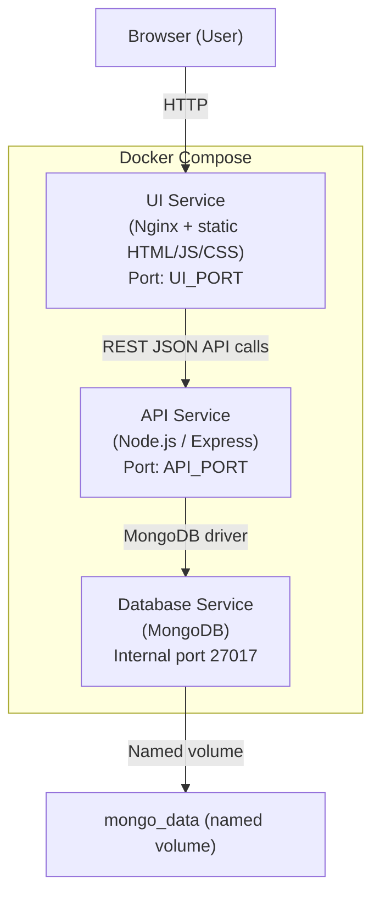

# Basic Job Application Tracking App

I created this just for the fun of it.  Its a Spec driven build in Kiro.  Application is a Docker 3 Tier build.  


Run is controlled with Docker Compose
```
docker compose up --build
```

