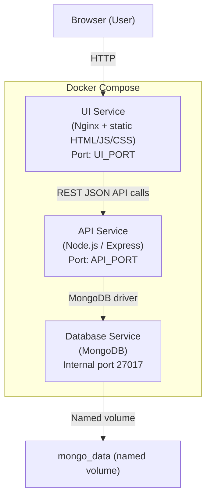

# Basic Job Application Tracking App

## Version
0.0.3 - Updated to allow for tracking
- ML Match
- Change application status
- Sankey application flow

## Purpose
I created this just for the fun of it.  Its a Spec driven build in Kiro.  Application is a Docker 3 Tier build.  

## Start Up
Run is controlled with Docker Compose
```
docker compose up --build
```

## Rebuild
To rebuild the container after changes:
```
docker compose down
docker compose up --build -d
```